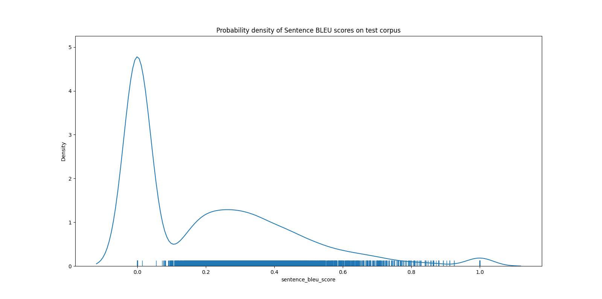
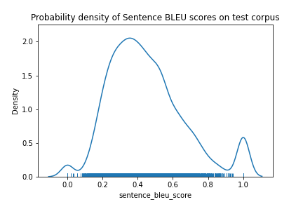

# Neural Machine Translation (NMT) Assignment

## Task
Machine Translation:  
Convert from **Spanish** to **English**.

## Data
[zip file](https://web.stanford.edu/class/archive/cs/cs224n/cs224n.1194/assignments/a4.zip)

## Result
### Corpus BLEU score
27.06437722023294 (Based upon the model trained for 13 epochs.)

### Interpretation of BLEU score
*The gist is clear, but has significant grammatical errors.*

For details, have a look at the [table](https://cloud.google.com/translate/automl/docs/evaluate#interpretation) which describes the interpretation of what the score range means.

### Output
- [csv file](./outputs/test_es_en_translation.csv)

- Columns:
    - **source**: Spanish (source) sentences
    - **translation_reference**: English (target) reference sentences
    - **translation_hypothesis**: English translation by NMT model
    - **sentence_bleu_score**: Sentence BLEU score
  
#### Probability density distribution of sentence BLEU scores

- Gaussian kernel density estimate plot using [Seaborn's distplot](https://seaborn.pydata.org/generated/seaborn.distplot.html).
- The above distribution shows that a significant number of translated sentences have very poor BLEU score (almost 0).

## Errata
Assignment code had the following error in the function
`utils.py # read_corpus()`  
 
Many sentences in `test.en` have consecutive multiple space characters. 
`line.strip().split(' ')` leads to empty strings in the split output.
Whereas the default `sep` parameter (i.e. `None`) of `split` discards the empty strings from the output.  

This led to increase of BLEU score by approximately 4.6.

#### Reference
https://stackoverflow.com/questions/2492415/how-can-i-split-by-1-or-more-occurrences-of-a-delimiter-in-python

## Comparison

### Marian NMT
- **Corpus BLEU score**: 34.55419013672562
- [Google Colab notebook](https://colab.research.google.com/drive/15UB3uSE0r0LqbX3u0N2MyxqvwinPj9_V?usp=sharing)
    - Notebook uses Marian NMT's HuggingFace model 
- Probability density distribution of sentence BLEU scores:
  
- **Observation**: Unlike the implementation in this repository, MarianNMT's model has very few close to 0 sentence BLEU score.
- **Translation Output**: [csv file](./outputs/marian_nmt_translation.csv)
- Website: https://marian-nmt.github.io/

## Note
Assignment heavily inspired by the https://github.com/pcyin/pytorch_nmt repository
